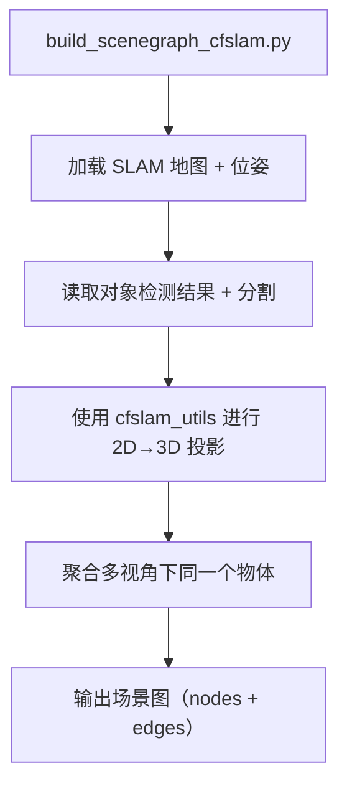

一个大型、模块化的视觉-语言-空间场景理解系统。
###  根目录级别
包含：
- `README.md`: 项目介绍文档
- `setup.py`: 安装入口，说明这是个可安装的 Python 包
- `environment.yml`: conda 环境配置
- `*.json/png`: 测试数据和配置
- `mapping_process.log`: 运行日志
- `conceptgraph/`: 主模块，**核心代码库**
###  conceptgraph/（主模块目录）
这是你研究的重点，里面包含多个子模块：
#### 1. `dataset/` → 数据相关模块
包含 RGB-D 数据读取、预处理、配置常量：
- `conceptgraphs_rgbd_images.py`：**封装 RGBD 图像类**，如 `RGBDImages`
- `conceptgraphs_datautils.py`：**数据预处理工具函数**
- `replica_constants.py`：Replica 数据集常量
- `save_record3d.py` / `preprocess_r3d_file.py`：处理 Record3D 数据
- `dataconfigs/`：不同数据集配置
#### 2. `slam/` → SLAM（定位与建图）模块
- `realtime_mapping.py`：实时建图逻辑
- `cfslam_pipeline_batch.py`：CF-SLAM 批处理流程
- `gui_realtime_mapping.py`：图形化 SLAM 界面
- `slam_classes.py`: 封装 SLAM 用到的类（地图块、位姿等）
- `utils.py`：相关辅助函数
#### 3. `scenegraph/` → 场景图构建模块
- `build_scenegraph_cfslam.py`：从 SLAM 结果构建场景图
- `merge_duplicate_objects.py`：合并重复物体
- `GPTPrompt.py`：与 GPT 接口联动，用于物体描述等
- `prompts/`: GPT 提示词集合
#### 4. `utils/` → 常用工具
各种通用功能，包括几何计算、图像处理、点云、评估等：
- `geometry.py`：如 `relative_transformation`、欧拉角转换等
- `general_utils.py`：如 `measure_time`，计时工具
- `image.py`, `pointclouds.py`, `projutils.py`：图像、点云处理
- `vis.py`：可视化相关
- `vlm.py`：视觉语言模型（如 LLaVA）工具封装
#### 5. `scripts/` → 测试 & 可视化脚本
- `run_slam_rgb.py`: SLAM 启动入口之一
- `visualize_cfslam_results.py`: 可视化 CF-SLAM 结果
- `generate_ai2thor_dataset.py`: 生成 AI2-THOR 格式数据
- `animate_mapping_interactive.py`: 动态可视化建图过程
#### 6. `configs/` 与 `hydra_configs/` → 配置模块
用于控制训练/推理流程（基于 Hydra 配置系统）：
- `base_mapping.yaml`、`record3d.yaml` 等定义不同场景配置
- `multirun_replica.yaml`、`streamlined_mapping.yaml`: 批量运行配置
#### 7. 其他模块
- `llava/`: 多模态大语言模型 LLaVA 封装
- `ai2thor/`: 与 AI2-THOR 交互的场景模拟工具
- `outputs/`, `multirun/`: 输出结果（可能是日志、可视化、预测等）
## 深入理解主流程（推荐顺序）
1. **从 `scripts/run_slam_rgb.py` 入手**：看项目是如何启动建图/识别流程的。
2. 顺着函数调用，查看：
   - 使用了哪个数据读取类？（一般是 `RGBDImages`）
   - 使用了哪个 SLAM pipeline？（如 `cfslam_pipeline_batch` 或 `realtime_mapping`）
   - 输出了什么？可视化？三维图？GPT prompt？
3. 查看 `scenegraph/build_scenegraph_cfslam.py`：从几何数据构建场景图
4. 最后，研究 `utils/` 工具和 `hydra_configs/` 中配置的调用方式，帮你定制流程。
## 小结：

```
conceptgraph/
├── dataset/       # 加载数据
├── slam/          # 做定位 + 建图
├── scenegraph/    # 基于SLAM构建场景图
├── utils/         # 工具库（图像、点云、可视化）
├── llava/         # 接入多模态语言模型
├── scripts/       # 快速运行和测试脚本
├── hydra_configs/ # 配置文件
├── outputs/       # 输出结果
```

## 构建三维场景图 Scene Graph（以 `cfslam` 为基础）

### 场景图构建的主要脚本入口：

```text
conceptgraph/scenegraph/build_scenegraph_cfslam.py
```

## 模块调用顺序图


## 文件级阅读顺序建议

| 步骤 | 文件路径 | 你可以关注什么内容 |
|------|-----------|-------------------|
| **1**️| `scenegraph/build_scenegraph_cfslam.py` | 项目构建三维 scene graph 的主脚本 |
| **2**️| `slam/streamlined_mapping.py` | 地图块、位姿、对象检测的空间转换方式（你会看到 `aggregate_3d_objects()`） |
| **3**️| `slam/utils.py` | 重要函数如 `project_mask_to_pointcloud()`，把 2D mask 映射到 3D 点云 |
| **4**️| `utils/geometry.py` | 几何转换，pose 处理，camera坐标到世界坐标的变换 |
| **5**️| `scenegraph/merge_duplicate_objects.py` | 合并多视角中检测到的同一物体（类似 cluster 合并） |

## 特别关注的函数

| 函数 | 所在文件 | 功能说明 |
|------|-----------|----------|
| `build_scenegraph_from_cfslam()` | `build_scenegraph_cfslam.py` | 整个 scene graph 构建主函数 |
| `project_mask_to_pointcloud()` | `slam/utils.py` | 把检测到的物体从 2D 分割 mask 投影到 3D |
| `merge_similar_objects()` | `merge_duplicate_objects.py` | 合并多视角中的重复物体 |
| `transform_pointcloud()` | `geometry.py` | 3D 点云坐标变换（相机 → 世界） |

## 场景图的组成：

```python
scenegraph = {
    "nodes": [
        {"id": 0, "label": "chair", "position": [x, y, z], ...},
        {"id": 1, "label": "table", "position": [x, y, z], ...},
    ],
    "edges": [
        {"source": 0, "target": 1, "relation": "on top of"}
    ]
}
```

- **nodes**：来自多视角合成的物体
- **edges**：空间关系由几何信息 + GPT 提示生成（比如：`GPTPrompt.py` 里）

## 阅读路径

1. `scenegraph/build_scenegraph_cfslam.py`（总入口）
2. `slam/streamlined_mapping.py` → 聚合与输入来源
3. `slam/utils.py` → 2D mask → 3D pointcloud
4. `utils/geometry.py` → 几何变换核心
5. `scenegraph/merge_duplicate_objects.py` → 多视角去重聚合
6. （可选）`GPTPrompt.py` → 语言关系生成


# data_common.py
**定义和加载支持多种 RGB-D 数据集（如 NICE-SLAM、Replica、TUM RGB-D、Azure Kinect 等）的 PyTorch Dataset 类，供后续 SLAM 或 3D 重建系统使用**。它统一了不同数据集的读取逻辑，并且可以选择性加载颜色图、深度图、相机位姿、内参矩阵，以及特征嵌入（如 CLIP 的语义特征）。


### 核心功能：

1. **自动读取图像路径、深度图路径、位姿等元数据**；
2. **图像和深度的下采样、归一化、channels-first等预处理**；
3. **支持不同格式的位姿文件（如 `.txt`, `.npy`, `.log`, `.json` 等）**；
4. **支持语义嵌入文件的读取和返回（如 `.pt` 文件的嵌入）**；
5. **封装为 PyTorch Dataset，用于数据迭代和批处理**；
6. **提供多种数据集类（例如 `ReplicaDataset`, `ICLDataset`, `AzureKinectDataset`, `MultiscanDataset` 等）供选择**。

#### case1：已有的数据格式与现有 Dataset 类（如 `ReplicaDataset`, `ScannetDataset`, `RealsenseDataset` 等）相同或类似

只需：

```python
from conceptgraph.dataset.datasets import get_dataset

dataset = get_dataset(
    dataconfig="/path/to/your/config.yaml",
    basedir="/path/to/your/data",
    sequence="scene_folder_name",  # 文件夹名
    start=0,
    end=-1,
    stride=1,
)
```

> `config.yaml` 文件里要写明 `dataset_name`、相机内参等信息
#### case2：有一个全新的 RGB-D 数据集，结构和其他的不同

需要：

1. **继承 `GradSLAMDataset` 基类**
2. **实现 3 个函数**：
   - `get_filepaths(self)`：返回 color、depth、embedding 路径列表
   - `load_poses(self)`：加载位姿并返回一个 pose 列表（每帧一个 \(4 \times 4\) 矩阵）
   - `read_embedding_from_file(self, embedding_file_path)`：如果加载嵌入，就处理它（可以简单返回 torch.load）


```python
class MyCustomDataset(GradSLAMDataset):
    def __init__(self, config_dict, basedir, sequence, **kwargs):
        self.input_folder = os.path.join(basedir, sequence)
        self.pose_path = os.path.join(self.input_folder, "poses.txt")
        super().__init__(config_dict, **kwargs)

    def get_filepaths(self):
        color_paths = sorted(glob.glob(f"{self.input_folder}/rgb/*.png"))
        depth_paths = sorted(glob.glob(f"{self.input_folder}/depth/*.png"))
        embedding_paths = None
        return color_paths, depth_paths, embedding_paths

    def load_poses(self):
        poses = []
        with open(self.pose_path, "r") as f:
            for line in f:
                mat = np.array(list(map(float, line.strip().split()))).reshape(4, 4)
                poses.append(torch.from_numpy(mat).float())
        return poses

    def read_embedding_from_file(self, embedding_file_path):
        return torch.load(embedding_file_path).permute(0, 2, 3, 1)
```

然后像其他 dataset 一样调用它。


###  `config.yaml` 示例：

```yaml
dataset_name: replica
camera_params:
  fx: 320
  fy: 320
  cx: 160
  cy: 120
  png_depth_scale: 1000.0
  image_height: 480
  image_width: 640
```

可以将 `dataset_name` 改成 `realsense`、`azure`、`scannet`、`multiscan` 等

### 总结

- 本脚本核心“**让不同数据集都能返回 color, depth, pose, K, embedding，统一格式进行处理**”；
- 换数据集：
  - 写清楚 `config.yaml`；
  - 数据放好，结构明确（比如 `color/*.png`, `depth/*.png`, `pose/*.txt`）；
  - 如果格式不同，就继承 `GradSLAMDataset`，自己写一个小类。

## conceptgraphs_datautils.py
提供了一些 **用于图像和相机内参预处理、位姿转换、标签图像生成** 的工具函数。
整个 `conceptgraph` 数据加载与处理流程中的基础工具之一。

### 模块的作用简要说明：

| 函数名 | 作用 | 用法 |
|--------|------|------|
| `normalize_image(rgb)` | 将 RGB 图像像素值从 `[0, 255]` 映射到 `[0, 1]`（float 类型） | 用于图像归一化预处理 |
| `channels_first(rgb)` | 将 `(H, W, C)` 格式的图像变为 `(C, H, W)` 格式（channel-first）| 深度学习中常见的 Tensor 格式要求 |
| `scale_intrinsics(K, h_ratio, w_ratio)` | 将相机内参 `K` 按照缩放比例调整，用于图像下采样后的匹配 | 图像 resize 后必须同步修改 `K` 才能保证投影正确 |
| `pointquaternion_to_homogeneous(...)` | 将 (位置 + 四元数) 转为 \(4 \times 4\) 的变换矩阵 | 通常用于将外部记录的位姿标准化为同一矩阵形式 |
| `poses_to_transforms(...)` | 将一组相机位姿变为相对于第一个帧的相对位姿（使第一帧为单位阵）| 可用于相对运动估计场景 |
| `create_label_image(prediction, color_palette)` | 给定语义分割预测图（每像素是类索引）和颜色表，生成可视化彩色标签图 | 用于展示预测结果 |

---

### 🔌 和你的 Dataset 脚本是如何关联的？

它们在 `conceptgraph.dataset.datasets.py` 中被用于：

- 图像读取和格式化：
  ```python
  if self.normalize_color:
      color = conceptgraphs_datautils.normalize_image(color)
  if self.channels_first:
      color = conceptgraphs_datautils.channels_first(color)
  ```
- 相机内参缩放处理：
  ```python
  K = conceptgraphs_datautils.scale_intrinsics(
      K, self.height_downsample_ratio, self.width_downsample_ratio
  )
  ```
- 相对位姿处理：
  ```python
  self.transformed_poses = relative_transformation(...)
  ```
## conceptgraphs_rgbd_images.py
主要作用是提供一个 **面向RGB-D图像序列的高层封装类 `RGBDImages`**，让你可以方便地管理、转换和可视化 RGB-D 图像序列（即彩色图像 + 深度图 + 相机内参 + 位姿）以及衍生的几何信息（如点云、法向量等）。

### 它解决了什么问题？

处理 RGB-D 数据常常涉及：
- 同时加载和管理彩色图、深度图、内参、外参
- 在多个图像帧之间保持一致结构
- 生成 **点云（Vertex Map）**、**法向量（Normal Map）**
- 将局部点云转换为全局坐标系（通过 `pose`）
- 支持可视化 / 动画回放

这段代码做的正是这些事。它借鉴自 `gradslam` 的设计思想，抽象出统一的 `RGBDImages` 数据结构，可以：

| 功能 | 方法 | 说明 |
|------|------|------|
| 获取彩色图像 | `rgb_image` | `(B, L, H, W, 3)` 或 `(B, L, 3, H, W)` 结构 |
| 获取深度图像 | `depth_image` | 同上，但最后一维是1通道 |
| 获取相机内参 | `intrinsics` | `(B, 1, 4, 4)` |
| 获取位姿信息 | `poses` | `(B, L, 4, 4)` |
| 获取像素位置网格 | `pixel_pos` | 用于重建点云，自动生成或外部传入 |
| 局部点云计算 | `vertex_map` | 乘以 `K^-1` 实现相机坐标点云恢复 |
| 局部法向量计算 | `normal_map` | 基于点云求导得出法向量 |
| 全局点云转换 | `global_vertex_map` | 利用 pose 变换点云坐标 |
| 全局法向量转换 | `global_normal_map` | pose 变换局部法向量 |
| 动画可视化 | `plotly()` | 返回可交互式 `plotly` 动画图表 |


### 数据结构理解

```python
RGBDImages(
    rgb_image: (B, L, H, W, 3),
    depth_image: (B, L, H, W, 1),
    intrinsics: (B, 1, 4, 4),
    poses: (B, L, 4, 4),
)
```

| 维度含义 | 说明 |
|----------|------|
| B | batch size（可以是多个场景） |
| L | 帧序列长度（多个时间帧） |
| H/W | 图像高宽 |
| 3/1 | RGB 或 深度通道 |

###  特别功能亮点

- **支持 Channel First / Channel Last 格式自动切换**：
  - `to_channels_first()` / `to_channels_last()` / 以及 `_permute_if_not_None`
- **支持嵌入图像、置信图（如 Open Vocabulary Detection）扩展**：
  - 属性如：`embeddings`, `confidence_image`
- **支持动态可视化**：
  - 使用 `plotly` 渲染彩色图 + 深度图，自动生成帧动画

###  在 ConceptGraph 项目中的用法

在 ConceptGraph 项目中，它很可能作为下游任务（如点云构建、多视图几何、cfslam）的数据接口，配合：

- 图像/深度解码器
- 轨迹估计器（用于传入 `poses`）
- 场景图模块（将 `global_vertex_map` 输入到物体检测模块中）

### 总结一句话：

> `conceptgraphs_rgbd_images.py` 提供了一个强大的 `RGBDImages` 类，它能将 RGB-D 图像数据（包括 intrinsics 和 poses）结构化地统一管理，并自动派生出点云、法向量、变换等几何信息，适用于多视图建图、SLAM 和 3D感知等任务。
## llava_model.py
自定义版本的 **LLaVA（Large Language and Vision Assistant）** 模型实现，叫 `LLaVaChat`，它把视觉模型（比如 CLIP 的视觉塔）和语言模型（LLaMA）连接起来，构建了一个可以处理图像和自然语言对话的系统。

简单来说，它实现了一个**视觉问答对话系统**，功能包括：
### 功能组件解释：

#### 1. `LlavaLlamaModelTweaked` 类
这是一个自定义的 `LLaMA` 模型，做了以下几件事：
- 接入了一个视觉塔（vision tower）如 `CLIPVisionModel`。
- 添加了图像特征到语言输入的桥接模块 `mm_projector`。
- 实现了图像编码、输入embedding拼接等操作。

#### 2. `LlavaLlamaForCausalLMTweaked` 类
这是整个模型的顶层，扩展了 `LlamaForCausalLM`，用于：
- 在图像存在的条件下融合图像特征。
- 用 `generate()` 生成语言输出，完成问答任务。

#### 3. `LLaVaChat` 类
这是对话封装器，主要用途：
- 加载模型、vision 模块和 tokenizer。
- 处理图像、查询、生成回复。
- 管理会话历史（使用 LLaVA 的 conv_template）。
- 支持命令行调用，进行图像问答。


### 运行流程概述：

1. 读取图像，并通过 `CLIPImageProcessor` 预处理。
2. 用 `CLIPVisionModel` 提取图像特征。
3. 构造带 `<image>` token 的 prompt，例如：
   ```
   What objects are in the image?
   <im_start><im_patch><im_patch>...<im_end>
   ```
4. 把文本和图像特征一起输入语言模型 `LlavaLlamaForCausalLMTweaked`。
5. 输出自然语言回答，例如：
   ```
   "A chair, a table, and a laptop."
   ```

### 模型用途
这个模型可以用于：
- 多模态对话系统
- 图像内容理解（VQA）
- 图像描述生成（Captioning）
- 多轮图文结合问答
当然可以！我来为你稍微**仔细、分模块**地讲解这段 LLaVA 模型代码，帮助你理清结构和它的实际工作过程。

**多模态对话系统**：你给它一张图片，它可以“看图说话”、回答问题、持续对话。
## 模块结构大致如下：

```
                    ┌───────────────────┐
                    │     图片          │
                    │   (如JPEG/PNG)    │
                    └────────┬──────────┘
                             ↓
                ┌─────────────────────────┐
                │ CLIPVisionModel         │ ← 图像编码器
                │ 提取图像 patch 特征      │
                └─────────────────────────┘
                             ↓
          ┌────────────────────────────────────┐
          │ mm_projector: 线性层               │ ← 把图像特征投影到语言模型空间
          └────────────────────────────────────┘
                             ↓
             ┌────────────────────────────────┐
             │ LLaMA (语言模型)                │
             │ 接收图像特征和对话提示，生成文字 │
             └────────────────────────────────┘
                             ↓
                     ┌──────────────┐
                     │ 最终回答文本 │
                     └──────────────┘
```

## 核心类解释（按调用流程）

### 1. `LLaVaChat`
这是你直接使用的入口类。它封装了对话流程、模型加载、图片预处理。

#### - `chat = LLaVaChat(...)`：
创建模型实例，初始化 tokenizer、视觉塔和 LLaMA。

#### - `chat.load_image(path)`：
加载并处理图像，转成 tensor。

#### - `chat.encode_image(tensor)`：
把图像送进 CLIPVisionModel 得到 patch 特征。

#### - `chat(query="这是什么？", image_features=...)`：
进行对话，自动处理图像 token，拼 prompt，然后调用模型生成回答。

### 2. `LlavaLlamaForCausalLMTweaked`
这是整个 LLaVA 模型的顶层封装，继承自 `LlamaForCausalLM`。

功能：
- 接收图像特征和文本，一起送入语言模型。
- 如果没有图像，就用 `<image>` 占位符。
- 最后返回回答。

### 3. `LlavaLlamaModelTweaked`
LLaMA 模型的多模态版本，关键逻辑包括：

#### `encode_image()`：
从 CLIP 视觉模型里提取隐藏层特征。

#### `forward()`：
图文融合逻辑：
- 把输入文本转为 embedding。
- 如果发现有 `<image>` token：
  - 把图像 patch 特征插入对应位置。
  - 然后送进语言模型 forward。
- 最终返回一个 logits，用来生成回答。

### 图像是怎么嵌进去的？

在 prompt 里：
```text
"List the objects.\n<im_start><im_patch><im_patch>...<im_end>"
```

程序就会识别这些 `<im_patch>` token 的位置，把 CLIP 输出的 patch 特征（比如 shape 是 1×256×1024）插入进去，代替原本的 token embedding，然后送进 LLaMA。

## 一个完整调用例子：
```python
chat = LLaVaChat(model_path="path/to/llava", num_gpus=1)
image = chat.load_image("image.jpg")
tensor = chat.image_processor.preprocess(image, return_tensors="pt")["pixel_values"][0]
features = chat.encode_image(tensor[None].half().cuda())
print(chat("Describe the image", image_features=features))
```
## 模型支持的任务
- 图像识别问答（"这是什么？"）
- 物品用途（"这些东西能干嘛？"）
- 图像内容理解（"描述这张图的场景"）
- 连续问答（可以保留历史上下文）

## 总结关键词

| 概念              | 含义说明 |
|-------------------|----------|
| CLIP              | 图像编码器，提取图像 patch 特征（视觉塔） |
| mm_projector      | 线性层，把图像特征投影到语言模型空间 |
| `<im_patch>`      | 视觉 token 占位符 |
| `conv_templates`  | 用于管理多轮对话的模板系统 |
| `image_features`  | 图像 patch 特征，送进语言模型做推理 |
| `generate()`      | HuggingFace 的文本生成函数 |

你现在给出的几个文件：

- `build_scenegraph_cfslam.py`
- `GPTPrompt.py`
- `merge_duplicate_objects.py`

它们共同构成了一个**基于3D重建和语言理解的场景图生成系统**的一部分。下面是对这些文件在整个 ConceptGraph 或类似项目中的 **作用和结构** 的详细解释：

### 整体目标是啥？

你目前的系统使用 SLAM（同时定位与地图构建）和大语言模型（如 GPT）来处理 RGB-D 图像数据，生成语义场景图。场景图是一个描述空间中物体之间关系的结构，例如：“桌子上有一台笔记本电脑”，“椅子靠近桌子”。

## 各文件作用详解
### 1. `GPTPrompt.py` —— 语言理解模块

这是一个为 GPT 等语言模型提供“系统提示词 + 示例”的模块（也就是 Prompt Engineering）。

**用途**：
- 将多个图像/点云分析结果生成的 caption，作为输入
- 对一个 3D 空间中物体的所有文本描述（来自不同视角）做**融合总结**，输出：
  - `summary`：简单描述
  - `possible_tags`：可能类别
  - `object_tag`：最终分类（如 "shelf"、"invalid"）

**用例**：
它为 LLM 准备 prompt + few-shot 示例，以便进行更准确的 object tag 分类。

### 2. `merge_duplicate_objects.py` —— 物体融合与清洗
这是一个**后处理脚本**，用来清洗和合并 SLAM 输出中的物体数据。
**功能**：
- 读取 SLAM 输出（一般是 `results.pkl.gz`）中的物体列表
- 根据阈值设置过滤掉：
  - 点云数量太少的对象
  - 检测次数太少的对象
- 使用 overlap（重叠程度）、视觉特征、文本特征进行**去重合并**

**核心函数**：
- `filter_objects(cfg, objects)`
- `merge_objects(cfg, objects)`

它生成一个**更干净且无重复的 object 列表**，用于构建最终场景图。

### 3. `build_scenegraph_cfslam.py` —— 场景图生成器（核心入口）

- 输入：处理过的物体列表（含空间位置、视觉特征、文本描述等）
- 输出：SceneGraph 图结构，包含：
  - 节点：3D空间中的语义物体
  - 边：物体之间的空间和语义关系（例如“在……上面”、“靠近”）

## `build_scenegraph_cfslam.py` 

## 文件整体功能：构建CFSLAM格式的3D Scene Graph

这个文件核心作用是：
> **将多视角下的图像 + 探测结果，通过多模态理解、语义推理与结构分析，构建出一个带有物体语义标签和物体关系的三维场景图（Scene Graph）。**
## 主函数入口 `main()`
```python
if __name__ == "__main__":
    main()
```

调用 `main()` 后，根据 `args.mode` 执行不同的子任务：
- `extract-node-captions`
- `refine-node-captions`
- `build-scenegraph` ✅（最核心）
- `generate-scenegraph-json`
- `annotate-scenegraph`

##  `build_scenegraph(args)` 是最关键的函数
这个函数完成了：
1. **载入CFSLAM生成的三维物体信息（scene_map）**
2. **读取每个物体的多模态 GPT/ChatGPT 的语义响应（描述标签）**
3. **剔除低置信度或无效物体**
4. **计算物体之间的空间重叠，构建邻接图**
5. **提取最小生成树，划分连接子图**
6. **用 GPT 再次分析子图内物体对之间的关系**
7. **构建最终的 scene graph：节点为物体，边为语义关系**

## 核心组成详解

### 1. 载入scene_map
```python
scene_map = MapObjectList()
load_scene_map(args, scene_map)
```
- 从 `cfslam_scene_map_pruned.pkl.gz` 加载。
- 每个物体是一个 dict，包含其 mask、bbox、类别、confidence 等。

### 2. 加载GPT响应并清洗
```python
with open(response_dir / f"{idx}.json", "r") as f:
    _d = json.load(f)
```
- 每个物体有一个 GPT 处理后的语义描述，包含字段如：
  ```json
  {
    "summary": "...",
    "possible_tags": [...],
    "object_tag": "chair"
  }
  ```
- 移除无效描述，如 `object_tag` 是 `invalid` 的。
- 剩下的结果保存在 `responses` 和 `object_tags` 中。

### 3. 空间结构分析构建邻接图
通过：
```python
bbox_overlaps = compute_overlap_matrix_general(args, scene_map)
```
- 计算所有物体对之间的3D bbox重叠程度。
- 用重叠面积构建一个加权邻接图。
- 取最小生成树 (`minimum_spanning_tree`) 保证图连通但无环。

### 4. 用GPT分析物体对之间的语义关系
对于 MST 里每一条边（物体对）：
```python
input_dict = {
    "object1": {id, bbox, object_tag},
    "object2": {id, bbox, object_tag}
}
```
传入GPT prompt：
```text
"a on b", "b on a", "a in b", "b in a", "none of these"
```
得到每对物体的：
```json
{
  "object_relation": "a on b",
  "reason": "because a chair is commonly placed on the floor..."
}
```
这一部分用到了 `openai.ChatCompletion.create(...)` 的调用。

### 5. 保存结果为最终Scene Graph
构造边列表：
```python
scenegraph_edges.append((segmentidx1, segmentidx2, object_relation))
```
- 节点：保留的物体段（segment）
- 边：具有合理语义关系的物体对

输出：
- `cfslam_scenegraph_edges.pkl`（边列表）
- `scene_graph.json`（用于可视化的精简版本）

## 其他辅助函数
除了主流程，还有：
- `refine_node_captions()`：改写节点描述，使用 GPTPrompt
- `generate_scenegraph_json()`：生成摘要 JSON 文件用于前端或网页展示
- `annotate_scenegraph()`：人工标注语义标签的小工具
- 各种 `crop_image_pil`, `draw_red_outline`, `display_images`：可视化和处理图像

## 总结理解路线图

```
图像 & 探测 ➝ 多模态描述（LLaVA + GPT） ➝ 剔除无效物体 ➝ 构图 ➝ 关系推理 ➝ Scene Graph
```

## 整个流程总结图

```
RGB-D 图像序列
       │
       ▼
   SLAM + 3D重建
       │
       ▼
  粗略物体点云 + Caption
       │
       ▼
  merge_duplicate_objects.py
       │
       ▼
  干净的物体列表（带位置、特征）
       │
       ▼
  GPTPrompt.py + LLM
       │
       ▼
 每个物体 -> object_tag、summary
       │
       ▼
 build_scenegraph_cfslam.py
       │
       ▼
Scene Graph 输出（可视化 + JSON + 交互）
```


## 总结一句话

这几个模块联合作用，是为了把**视觉 + 几何 + 多模态语言理解**融合在一起，生成一个可以被人或下游 AI 理解的 3D 室内场景图。


**物体之间的关系是通过 GPT 获得的**。整个关系推理的关键逻辑在于：


### 物体关系提取流程（在 `build_scenegraph()` 里）

#### 1. 首先构建物体之间的连接图
```python
adj_mat = compute_overlap_matrix_general(...)
mst = minimum_spanning_tree(adj_mat).toarray()
```
- 所有物体之间先根据 3D 重叠关系（或者近邻）构建一个连接矩阵。
- 然后提取最小生成树（MST），保证物体之间是连通的，减少冗余边。


#### 2. 遍历MST边，获取物体对（segmentidx1, segmentidx2）

对于每一对物体，调用 GPT 来判断它们之间的关系：

```python
input_dict = {
    "object1": {
        "object_id": segmentidx1,
        "bbox": bbox1,
        "object_tag": object_tags[segmentidx1],
    },
    "object2": {
        "object_id": segmentidx2,
        "bbox": bbox2,
        "object_tag": object_tags[segmentidx2],
    },
}
gpt_response = prompt_fn.get_object_relation(input_dict)
```


### 3. GPT Prompt 长这样（在 `GPTPrompt.py` 中）

你上传的 `GPTPrompt.py` 中，`get_object_relation()` 函数会把 `input_dict` 构造成如下 Prompt：

```text
Given the following two objects:
- Object 1: chair, bbox = [x1, y1, z1, x2, y2, z2]
- Object 2: table, bbox = [x1, y1, z1, x2, y2, z2]

Which of the following best describes their relationship?
A. object1 on object2
B. object2 on object1
C. object1 in object2
D. object2 in object1
E. none of the above

Please also give a short reason for your answer.
```

然后调用 GPT（可能是 `gpt-3.5-turbo` 或 `gpt-4`）生成回答：

```json
{
  "object_relation": "object1 on object2",
  "reason": "Because a laptop is typically placed on a desk"
}
```


### 最终结果存为 scenegraph_edges
```python
scenegraph_edges.append((segmentidx1, segmentidx2, object_relation))
```
这些边就组成了最终的 scene graph 的语义结构。


## 总结一下

物体关系提取 = 
1. 构建连接图（基于3D重叠）
2. 遍历物体对
3. 构造 GPT prompt（两个物体 + bbox + 标签）
4. GPT 输出：关系类型（on/in/none）+ 原因
5. 存为边：`(物体1, 物体2, 关系)`

---

## 场景图（Scene Graph）关系的提取：大致流程

在这个项目中，我们有多个物体（比如桌子、椅子、电脑等），我们想要搞清楚：

> **“这些物体之间有什么关系？”**

比如：
- “椅子 **在** 桌子 **旁边**”
- “显示器 **在** 桌子 **上**”
- “鼠标 **靠近** 键盘”

这个关系 **不是靠规则写死的**，而是通过一个强大的语言模型（比如 GPT）来“**推理**”的。


## 步骤 1：先把物体的位置、标签提取出来

系统先完成：
- 每个物体的 **3D 边界框（bbox）**：表示它在三维空间的位置和大小。
- 每个物体的 **标签（object_tag）**：比如“chair”、“table”、“monitor”。


## 步骤 2：找出要推理关系的物体对

比如房间里有：
- 物体 1: "chair"，坐标是 `[1, 0, 1.2, 1.5, 0.5, 1.5]`
- 物体 2: "table"，坐标是 `[1, 0, 0.5, 2, 1, 1.0]`

然后就会组织成一个字典：

```python
{
  "object1": {"object_id": 1, "bbox": [...], "object_tag": "chair"},
  "object2": {"object_id": 2, "bbox": [...], "object_tag": "table"}
}
```

## 步骤 3：构造一个 GPT Prompt（提示词）

程序会把上面的信息变成一个类似这样的提问，发送给 GPT：

```
Given the following two objects:
- Object 1: chair, bbox = [1, 0, 1.2, 1.5, 0.5, 1.5]
- Object 2: table, bbox = [1, 0, 0.5, 2, 1, 1.0]

Which of the following best describes their relationship?
A. object1 on object2
B. object2 on object1
C. object1 in object2
D. object2 in object1
E. none of the above

Please also give a short reason for your answer.
```


## 步骤 4：GPT 生成回答（通过 API 或本地模型）

GPT 看到这个问题，会“理解”语义+空间关系，然后输出：

```json
{
  "object_relation": "object1 on object2",
  "reason": "A chair is typically placed on the ground next to a table."
}
```

这样就得到了一个结构化的回答！


## 步骤 5：记录这条边

将这两个物体的关系存下来：

```python
scenegraph_edges.append((1, 2, "on"))
```

这就表示：
> 在场景图中，编号 1 的物体（chair）和编号 2 的物体（table）有关系：“on”。


## 多组物体，批量进行

程序会对场景里的 **所有可能的物体对** 都做一次这样的推理，一对一对地问 GPT。


## 最终产出

你会得到一个 scene graph，里面是物体编号之间的连接关系，比如：

```
(0, 1, "on")
(1, 2, "next to")
(3, 1, "in")
...
```

也可以画成图。


## 图示

```
chair ---on---> table
      \        /
       next to
         \
         monitor
```

---
ConceptGraph 项目中 `utils/` 文件夹里的工具脚本，主要提供图像处理、点云投影、模型加载、视觉语言处理、三维几何运算、可视化等功能支持。

### 环境相关
- **`ai2thor.py`**：用于与 AI2-THOR 模拟环境交互，可能定义了房间布局、对象管理等接口。
- 封装了对 AI2-THOR 环境的调用逻辑。
- 提供与 AI2-THOR 场景交互的函数，如物体属性提取、场景状态读取、抓取位置判断等。
- 用于与虚拟环境（特别是家居场景）构建可交互的 3D Scene Graph。
- **`record3d_utils.py`**：用于处理 Record3D 相机录制的数据，如深度图与 RGB 帧的同步和格式转换。
- 与 Record3D 数据格式交互的工具。
- 读取其深度数据、RGB 数据、相机 pose 等。
- 用于将 iPhone 的深度视频数据转换为可以用于建图的格式。

### 模型与评估
- **`model_utils.py`**：包含模型加载、初始化、保存等工具函数。
- 提供模型加载、保存、权重初始化的接口。
- 兼容不同模型格式（例如 torchvision、transformers）。
- 常用于加载视觉模型、语言模型、视觉语言融合模块。
- **`eval.py`**：用于评估模型性能，比如计算各种指标（IoU、准确率等）。
- 定义了场景图评估指标，包括 precision、recall、f1-score。
- 支持对比 GT scene graph 和 predicted scene graph。
- 输出详细的评估报告，便于调参和 ablation study。
- **`logging_metrics.py`**：记录和管理评估指标，支持日志输出与统计汇总。
- 管理实验日志和训练指标记录。
- 支持 TensorBoard 可视化、JSON 保存。
- 也可能用于评估模块打印统计信息。
- **`optional_rerun_wrapper.py`**：提供一个运行重试机制，防止程序异常崩溃。提供 @rerun_if_needed 装饰器，适合数据预处理或多阶段 pipeline 中的中间结果复用。
- 某函数结果已存在则跳过执行。
- 支持缓存机制和条件重跑。

### 多模态与语言模型
- **`vlm.py`**：处理 VLM（视觉语言模型）相关任务，可能调用 LLaVA 等模型对图像进行描述或关系提取。
- 封装多模态大模型（如 LLaVA、GPT）的接口。
- 图片 + 文本 → 关系文本的推理。
- 调用 GPT 进行物体关系生成（物体 A 在物体 B 上方）。
- 构建 Scene Graph 中“语义关系”的核心。
- **`structutils.py`**：结构化处理数据结构（如 scene graph 的 nodes、edges），在构建图时使用。
- 定义了场景图中核心的数据结构，例如 SceneGraph, ObjectNode, RelationEdge。
- 提供了用于合并 Scene Graph、更新节点属性、处理嵌套结构的工具函数。
- 是整个 Scene Graph 构建模块的核心结构定义文件。

### 图像与可视化
- **`image.py`**：基础图像处理函数，如 resize、normalize、格式转换等。视觉预处理的模块,处理图像相关的任务。
- 归一化、通道变换（HWC↔CHW）
- 可视化 segmentation mask
- 对 RGB-D 图像进行批处理和拼接
- **`vis.py`**：用于可视化 RGBD 图像、点云、预测 mask、关系图等，常用于调试和展示结果。
- 提供了可视化工具函数，包括：
- 绘制 3D 点云、Mesh、相机轨迹等。
- 使用 open3d 渲染交互式的 3D 可视界面。
- 用于调试 Scene Graph 中的几何关系是否正确。

### 几何与数学计算
- **`geometry.py`**：处理几何变换（例如：坐标变换、法向量计算、深度图转点云）。提供几何相关的计算工具，用于判断物体之间是否在“上方”、“前方”等几何关系。
- 空间变换矩阵（SE3）计算
- 点之间角度、方向判断
- 旋转矩阵与四元数之间转换
- **`projutils.py`**：主要进行投影和反投影的数学操作（如将 2D 图像坐标转换为 3D）。提供投影相关的工具函数, 广泛用于 RGB-D 图像与三维空间的变换。
- 从深度图像反投影到 3D 点云。
- 从 3D 点云投影到图像平面。
- **`pointclouds.py`**：生成和操作点云，包括法向量、颜色映射等。点云数据处理工具，用于将 RGB-D 数据构建成几何 3D 表示。
- 法向量估计、法向滤波、采样、合并。
- 点云 → Mesh 转换。
- **`ious.py`**：计算交并比（IoU），在目标检测与分割中常用。
- 提供 IOU（Intersection-over-Union）计算工具。
- 支持 2D box、3D box、mask 的 IOU 计算。
- 可用于评估语义分割、目标检测、物体合并等模块效果。
### 通用工具
- **`general_utils.py`**：其他零散的工具函数（如时间测量、路径检查、文件读写等）。用于支撑各个模块的通用功能。
- 安全创建文件夹
- 递归搜索文件
- 打印颜色文本
- 读取配置文件（如 JSON）
- 时间戳格式化
### 概览：`slam/` 文件夹的作用  
该模块是 ConceptGraph 项目中的 **SLAM 映射子系统**，核心功能是：

- 实时构建物体语义增强的三维地图（3D scene graph）
- 支持多个数据源（如 Record3D）
- 结合 Open-vocabulary detection + 实时相机位姿
- 可选地接入可视化（如 GUI / Rerun）


#### 1. `cfslam_pipeline_batch.py`
- 用途：批量处理输入数据（RGB-D 图像 + 位姿），生成语义增强点云，并构建场景图。
- 功能：
  - 加载 RGB 图像、深度图、相机内参和位姿
  - 使用 `build_scenegraph_cfslam` 进行场景图构建
  - 调用 `merge_duplicate_objects` 去重
  - 保存结果为 `.npz` 或 `.json`
- 通常用于离线批处理模式，而非实时。
#### 2. `gui_realtime_mapping.py`
- 用途：提供图形化界面（GUI）进行实时建图。
- 基于 Open3D 或其他 GUI 库（例如 PyQt）展示点云和检测结果。
- 包括：图像显示、语义结果更新、交互式调试等。
#### 3. `mapping.py`
- 用途：封装了地图构建的底层逻辑，通常由其他脚本调用。
- 提供：
  - 地图初始化、点云融合
  - 与检测器（open-vocabulary detector）协同
  - 动态更新场景图
- 是核心模块之一，负责“融合+管理”的部分。
#### 4. `r3d_stream_rerun_realtime_mapping.py`
- 用途：从 Record3D 流中读取实时 RGB-D 数据 + 位姿，并进行建图。
- 接收移动端传来的视频流
- 使用 Rerun SDK 进行可视化（`import rerun as rr`）
#### 5. `realtime_mapping.py`
- 用途：不依赖 Record3D 的普通实时建图版本。
- 输入可能来自摄像头或图像文件夹（非 stream）
- 适合桌面系统使用，功能与 `r3d_stream_rerun_realtime_mapping` 类似但更通用
#### 6. `rerun_realtime_mapping.py`
- 用途：与 `realtime_mapping` 相似，但添加了 **Rerun 可视化支持**
- 每帧都将图像、检测框、点云等发送给 Rerun Server
- 用于调试 / 直播展示等场景
#### 7. `slam_classes.py`
- 定义核心数据结构：
  - `SceneGraph`: 存储物体节点及其空间关系
  - `MapPointCloud`: 管理整个点云地图
  - `DetectedObject3D`: 表示一个三维检测物体（位置、类别、得分、mask）
- 是所有 slam 模块的“数据骨架”
#### 8. `streamlined_mapping.py`
- 用途：一个简化版的映射流程，整合多个功能以支持更清晰的构建。
- 结构更精炼，适合教学、调试或作为 backbone
- 包含多个封装函数：图像处理、融合、关系推理等
- 对接 GPT 模型（调用 `GPTPrompt.py`）以实现场景图语义生成
#### 9. `utils.py`
- 是 `slam` 子模块的工具函数集合。
- 包括：
  - 位姿变换
  - 深度图转点云
  - 保存文件的函数（如 `.npz`、`.json`）
  - 可视化辅助函数
